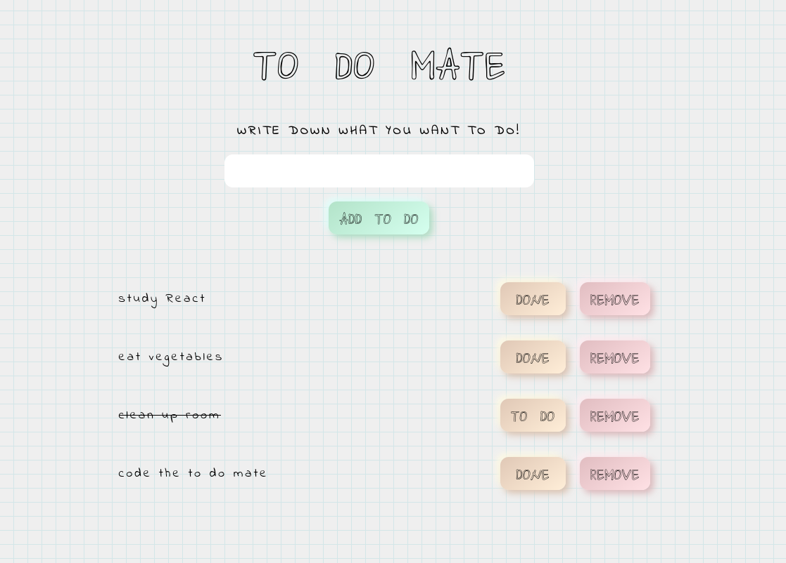

# TO DO MATE

A to do app created to practice React Context and localStorage usage.

**Deployment:**

Visit the app at [https://todomate.surge.sh](https://todomate.surge.sh).

**The app implements:**

- React
- localStorage API
- animations
- responsiveness
